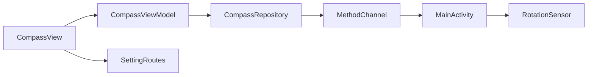

# F Compass

Android compass app that shows live heading (0–360°) and cardinal direction using Flutter and a native **MethodChannel**.

Heading updates come from the rotation vector sensor on Android; the UI rotates a compass dial and displays degrees.

Modular layout separates sensor access, settings, and shared routing or theming.

## Structure



## Stack

| Technology | Version |
|------------|---------|
| Dart SDK | ^3.13.4 |
| cupertino_icons | ^1.0.8 |
| get_it | ^9.2.1 |
| go_router | ^17.2.3 |
| shared_preferences | ^2.5.5 |
| flutter_lints | ^6.0.0 |
| build_runner | ^2.15.0 |
| mockito | ^5.6.4 |
| Android Gradle Plugin | 9.1.0 |
| Kotlin | 2.4.0 |
| NDK | 30.0.16248370 |
| compileSdk / targetSdk | 36 |
| minSdk | 29 |
| JVM | 25 |

## Architecture

The project is structured in a modular way, where each new functionality should be a new module containing its particularities, and things common to the entire project should be in the `common` module.

```
src/
    ├── common/
    │   ├── constants/
    │   ├── dependency_injectors/
    │   ├── routes/
    │   ├── services/
    │   └── state_management/
    └── features/
        ├── compass/
        │   ├── models/
        │   ├── repositories/
        │   ├── routes/
        │   ├── view_models/
        │   └── views/
        └── settings/
            ├── models/
            ├── repositories/
            ├── routes/
            ├── view_models/
            └── views/
```

## Android / MethodChannel

Channel: `br.com.williamfranco.f_compass/compass`

| Direction | Method | Description |
|-----------|--------|-------------|
| Dart → native | `isAvailable` | Whether rotation vector (or game rotation) sensor exists |
| Dart → native | `startListening` | Register sensor listener |
| Dart → native | `stopListening` | Unregister listener |
| Native → Dart | `updateHeading` | Azimuth in degrees `[0, 360)` |

Native code lives in `android/app/src/main/kotlin/.../MainActivity.kt`. iOS is not implemented for compass in v1.

## Coverage

flutter pub run build_runner build --delete-conflicting-outputs

flutter test --coverage

genhtml coverage/lcov.info -o coverage/html

open coverage/html/index.html

## ScreenShots

| Image 1 | Image 2 | Image 3 |
|----------|----------|----------|
|  |  |  |

| Image 4 | Image 5 | Image 6 |
|----------|----------|----------|
|  |  |  |

## Commits

```
git add . && git commit -m ":rocket: Initial commit." && git push
git add . && git commit -m ":building_construction: Added initial project architecture." && git push
git add . && git commit -m ":building_construction: Update project architecture." && git push
git add . && git commit -m ":memo: Updated project documentation." && git push
git add . && git commit -m ":memo: Updated code documentation." && git push
git add . && git commit -m ":white_check_mark: Added feature xyz." && git push
git add . && git commit -m ":wrench: Fixed xyz usage." && git push
git add . && git commit -m ":heavy_minus_sign: Removed xyz." && git push
git add . && git commit -m ":memo: Adjusted project imports." && git push
git add . && git commit -m ":arrow_up: Updated dependencies." && git push
git add . && git commit -m ":arrow_down: Removed dependencies." && git push
git add . && git commit -m ":wastebasket: Removed unused code." && git push
git add . && git commit -m ":test_tube: Added test functionality xyz." && git push
git add . && git commit -m ":construction_worker: Building in progress." && git push
git add . && git commit -m ":construction_worker: Added CI build system." && git push
```

## License

[MIT License](https://opensource.org/licenses/MIT)

Copyright (c) 2026 William Franco.
